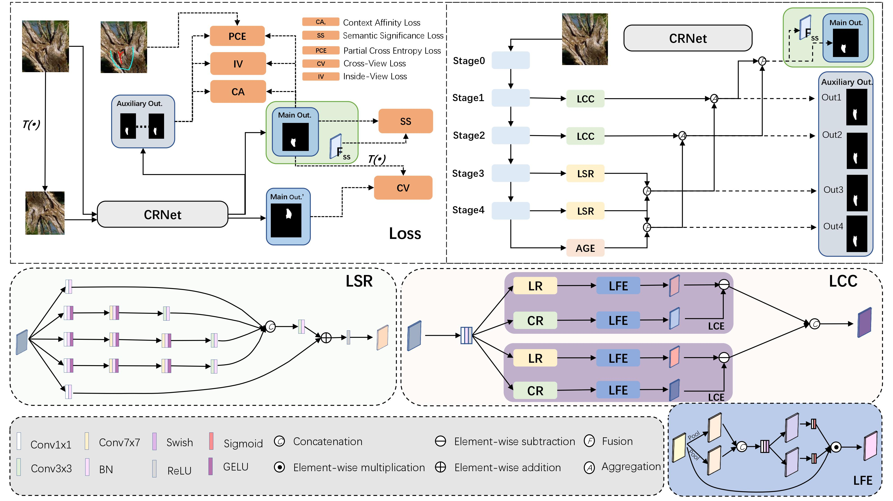
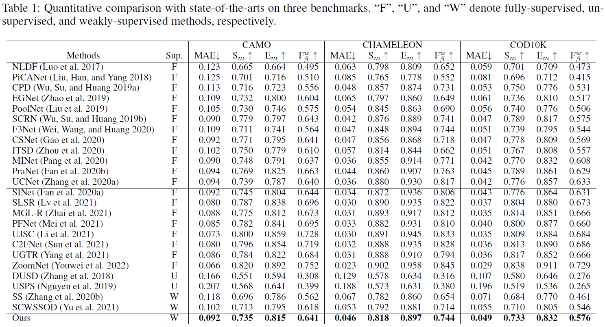

# Weakly-Supervised Camouflaged Object Detection with Scribble Annotations (AAAI23)
> Authors: Ruozhen He*, Qihua Dong*, Jiaying Lin, and Rynson Lau (* joint first authors)

Paper Link: [arxiv](https://arxiv.org/abs/2207.14083)

## Dataset
- We relabeled 4,040 images (3,040 from COD10K, 1,000 from CAMO) with scribbles and proposed the **S-COD dataset** [(Download)](https://drive.google.com/file/d/1u7PRtZDu2vXCRe0o2SplVYa7ESoZQFR-/view?usp=sharing) for training. In our annotations, "1" stands for foregrounds, "2" for backgrounds, and "0" for unlabeled regions.
- Download the training dataset (COD10K-train) at [here](https://drive.google.com/file/d/1D9bf1KeeCJsxxri6d2qAC7z6O1X_fxpt/view?usp=sharing).
- Download the testing dataset (COD10K-test + CAMO-test + CHAMELEON) at [here](https://drive.google.com/file/d/1QEGnP9O7HbN_2tH999O3HRIsErIVYalx/view?usp=sharing).

## Experimental Results
- We provide CRNet [testing maps](https://drive.google.com/file/d/1UmoNMWv0JnjK2oFZkSjicCeYQXO2tj6Y/view?usp=sharing) and [training weights](https://drive.google.com/file/d/1hAvbPN6dSwulq3BZefTZkm9FfX3S2EBG/view?usp=sharing) presented in the papers.

## Code
### Requirements
`
git clone --recurse-submodules https://github.com/dddraxxx/Weakly-Supervised-Camouflaged-Object-Detection-with-Scribble-Annotations.git
pip install -r requirements.txt
`

### Pretrained weights
The pretrained weight can be found here:
[ResNet-50](https://drive.google.com/file/d/1Lt6o2YBYiFIhdKlN0WEInMroPoDZ8cgh/view?usp=sharing).

### Train
- Download the dataset and pretrained model.
- Modify the path in `train.py`.
- Run `python train.py`.

### Test and Evaluate
- The evaluation is done using the submodule [PySODEvalToolKit](https://github.com/lartpang/PySODEvalToolkit.git). Add the json files according to its instruction. 
- Modify the path and filename.
- Run `python test.py`.

### Credit
The code is partly based on [SCWSSOD](https://github.com/siyueyu/SCWSSOD.git), [GCPANet](https://github.com/JosephChenHub/GCPANet) and [GatedCRFLoss](https://github.com/LEONOB2014/GatedCRFLoss).
